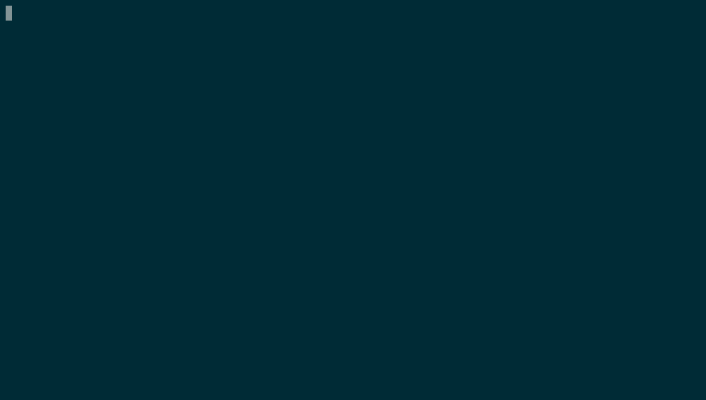

# Muffet

[](https://github.com/raviqqe/muffet/actions)
[](https://codecov.io/gh/raviqqe/muffet)
[](https://goreportcard.com/report/github.com/raviqqe/muffet)
[](https://hub.docker.com/r/raviqqe/muffet)
[](LICENSE)



Muffet is a website link checker which scrapes and inspects all pages in a
website recursively.

## Features

- Massive speed
- Colored outputs
- Different tags support (`a`, `img`, `link`, `script`, etc)

## Installation

```
GO111MODULE=on go get -u github.com/raviqqe/muffet/v2
```

## Usage

```
muffet https://shady.bakery.hotland
```

For more information, see `muffet --help`.

## License

[MIT](LICENSE)
